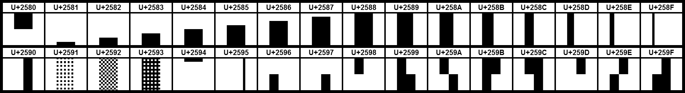

# terminalvideoplayer

## Introduction

This is a cursed terminal video player. This improves on some previous designs by implementing some optimisations such as not changing the text/background colour if the next pixel is similar enough. The video player also manages to get 11 "pixels" (effectively) out of every character as opposed to the usual 2 pixels by using the unicode quarter block characters. The pixels however aren't really independent, and each character is still limited to two colours.

Mileage may vary depending on how fast your terminal is. In my testing, I've found that [alacritty](https://github.com/alacritty/alacritty) works rather well.

```sh
.\tvp filename [threshold] 
```

The threshold has to be an integer from 0 to 255, and defaults to 10. The threshold affects how much the colour of a certain pixel has to change before it will be redrawn. A lower threshold results in more redraws in most cases, and leads to choppy video. It relies on [ffmpeg](https://www.ffmpeg.org/) in order to decode the video input.

Built on Manjaro with this command:

```sh
g++ src/main.cpp src/video.cpp -Iinc/ -std=c++17 -O3 -o tvp -lavformat -lavcodec -lavutil -lswscale
```

Below is a preview of how it looks:


## How it works

This is not a new concept. But most terminal video players I have seen use two pixels per character. The unicode character  ▄  (U+2584 lower half block) as the bottom half of the pixel, which can be coloured using the ANSI code for font colour, and the background colour, as the other pixel.

But, if you search up the unicode block characters, you see this:



Clearly there is potential here. By using the unicode quarter block characters, as well as the half blocks

- ▘  (U+2598 quadrant upper left)
- ▝  (U+259D quadrant upper right)
- ▖  (U+2596 quadrant lower left)
- ▗  (U+2597 quadrant lower right)
- ▞  (U+259E quadrant upper right and lower left)
- ▄  (U+2584 lower half block)
- ▐  (U+2590 right half block)
- ▂  (U+2582 lower quarter block)
- ▆  (U+2586 lower 3 quarters block)
- ▎  (U+258E left quarter block)
- ▊  (U+258A left 3 quarters block)

We have all the building blocks for effectively kind of quadruple the horizontal and double the vertical resolution! However, we are still limited to two colours per pixel. So, we pick the configuration that minimizes the maximum difference between colours which will be made the same, and then set the colour to the average colour.

Other optimisations include 

- only changing pixels whose colour have changed a certain value
- only inputting the ANSI code for cursor move when the next pixel isn't contiguous
- only inputting the ANSI code for background colour change when the background colour differs significantly (set as a compile option)

